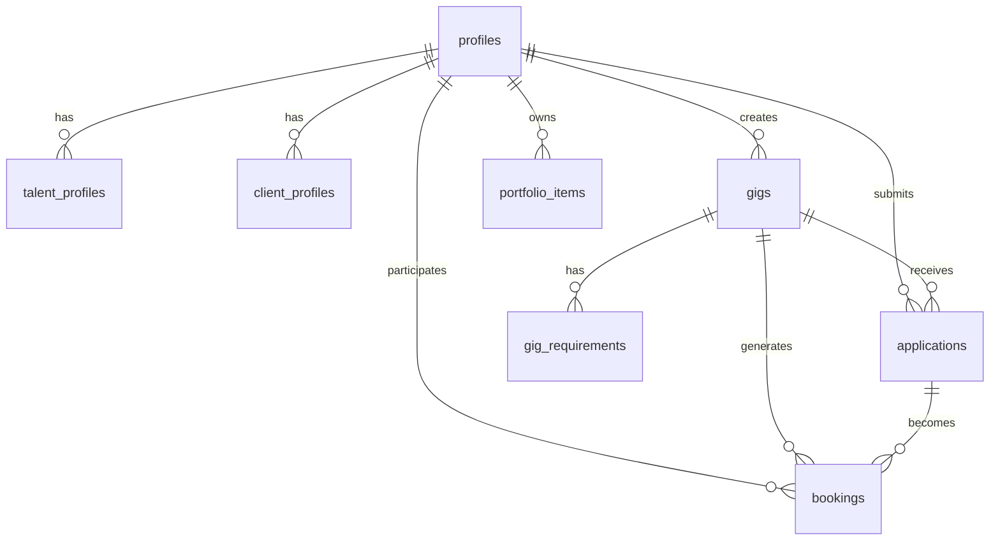
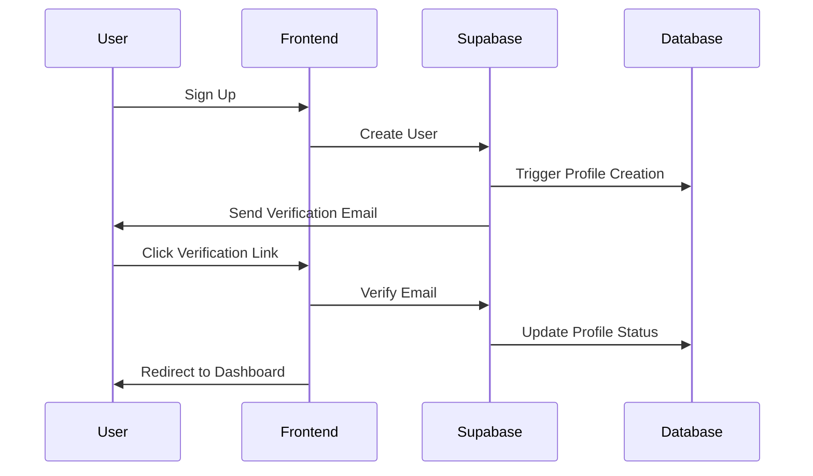

<div align="center">

# 🎭 TOTL Agency


**Premium Talent Booking Platform**

*Connecting exceptional talent with premium opportunities worldwide*

[](https://www.thetotlagency.com)
[](https://nextjs.org/)
[](https://www.typescriptlang.org/)
[](https://supabase.com/)
[](https://www.thetotlagency.com)

[🚀 **Live Demo**](https://www.thetotlagency.com) • [📖 **Documentation**](#-documentation) • [🛠️ **Development**](#-development) • [🚀 **Deployment**](#-deployment)

</div>

---

## 🌟 **Overview**

TOTL Agency is a comprehensive talent booking platform that revolutionizes how models, actors, and performers connect with casting directors, agencies, and brands. Built with cutting-edge technology and designed for scalability, it provides a seamless experience for talent discovery, gig management, and professional networking.

### ✨ **Key Features**

<table>
<tr>
<td width="50%">

🎭 **Talent Management**
- Comprehensive talent profiles
- Portfolio management
- Application tracking
- Performance analytics

</td>
<td width="50%">

🏢 **Client Solutions**
- Gig posting & management
- Talent discovery
- Application review
- Booking management

</td>
</tr>
<tr>
<td width="50%">

🔐 **Security & Auth**
- Role-based access control
- Secure authentication
- Email verification
- Password protection

</td>
<td width="50%">

📧 **Communication**
- Automated email system
- Verification workflows
- Notification system
- Professional templates

</td>
</tr>
</table>

---

## 🛠️ **Tech Stack**

<div align="center">

| Category | Technology | Version | Purpose |
|----------|------------|---------|---------|
| **Frontend** | Next.js | 15.5.4 | React framework with App Router |
| **Language** | TypeScript | 5.0 | Type-safe development |
| **Styling** | TailwindCSS | 3.4.17 | Utility-first CSS |
| **UI Components** | shadcn/ui | Latest | Accessible component library |
| **Backend** | Supabase | Latest | PostgreSQL + Auth + Storage |
| **Email** | Resend | Latest | Transactional email service |
| **Deployment** | Vercel | Latest | Frontend hosting platform |

</div>

---

## 🛡️ **TypeScript Type Safety**

TOTL Agency enforces **strict TypeScript type safety** across the entire codebase:

- ✅ **0 TypeScript errors** policy - builds fail on any type error
- ✅ **Full database type inference** with Supabase
- ✅ **Production builds enforce type checking**
- ✅ **Comprehensive type coverage** across all components

### 🔑 **Key Patterns:**
```typescript
// Client components: Use createSupabaseBrowser() with null checks
const supabase = createSupabaseBrowser();
if (!supabase) return;

// Server components: Use createSupabaseServer()
const supabase = await createSupabaseServer();

// Always run typecheck before committing
npm run typecheck
```

📖 **See** [`docs/development/TYPE_SAFETY_IMPROVEMENTS.md`](./docs/development/TYPE_SAFETY_IMPROVEMENTS.md) for complete type safety documentation.

---

## 🚀 **Quick Start**

### 📋 **Prerequisites**

- **Node.js** 18+ 
- **npm** or **yarn**
- **Supabase** account
- **Resend** API key

### ⚡ **Installation**

```bash
# 1. Clone the repository
git clone https://github.com/your-username/totl-agency.git
cd totl-agency

# 2. Install dependencies
npm install

# 3. Set up environment variables
cp .env.example .env.local
# Edit .env.local with your credentials

# 4. Start development server
npm run dev
```

### 🔧 **Environment Setup**

Create `.env.local` with your credentials:

```env
# 🌐 Site URL
NEXT_PUBLIC_SITE_URL=https://www.thetotlagency.com

# 📧 Resend (Email API)
RESEND_API_KEY=re_your-resend-api-key-here

# Supabase Access Token
SUPABASE_ACCESS_TOKEN=sbp_your-access-token-here

# 🔑 Supabase Service Role Key (⚠️ Only use server-side)
SUPABASE_SERVICE_ROLE_KEY=eyJhbGciOiJIUzI1NiIsInR5cCI6IkpXVCJ9.your-service-role-key-here

# 🔗 Supabase URL (base URL for all Supabase calls)
SUPABASE_URL=https://your-project-ref.supabase.co
NEXT_PUBLIC_SUPABASE_URL=https://your-project-ref.supabase.co

# 🔓 Supabase Anon Public Key (safe to expose to frontend)
NEXT_PUBLIC_SUPABASE_ANON_KEY=eyJhbGciOiJIUzI1NiIsInR5cCI6IkpXVCJ9.your-anon-key-here
```

### 🎯 **Quick Commands**

```bash
# Development
npm run dev              # Start development server
npm run build            # Production build
npm run start            # Start production server

# Environment & Testing
npm run env:test         # Test environment configuration
npm run env:check        # Quick environment check
npm run env:setup        # Interactive environment setup

# Database & Types
npm run types:regen      # Regenerate TypeScript types
npm run schema:verify    # Verify database schema
npm run db:push          # Push migrations to remote

# Quality Assurance
npm run typecheck        # TypeScript type checking
npm run lint             # ESLint code analysis
npm run verify-all       # Run all verification checks
```

---

## 🏗️ **Architecture**

### 📊 **Database Schema**

<div align="center">



</div>

### 🔐 **Authentication Flow**



### 🎭 **User Roles & Access**

| Role | Dashboard | Capabilities | Access Level |
|------|-----------|--------------|--------------|
| **🎭 Talent** | `/talent/dashboard` | Browse gigs, apply, manage profile | View active gigs, submit applications |
| **🏢 Client** | `/client/dashboard` | Post gigs, review applications | Create/edit gigs, manage applications |
| **👑 Admin** | `/admin/dashboard` | User management, platform oversight | Full platform access |

---

## 📁 **Project Structure**

```
totl-agency/
├── 🎭 app/                    # Next.js App Router pages
│   ├── (auth)/               # Authentication pages
│   ├── talent/               # Talent dashboard & features
│   ├── client/               # Client dashboard & features
│   ├── admin/                # Admin panel
│   └── api/                  # API routes
├── 🧩 components/            # React components
│   ├── ui/                   # shadcn/ui components
│   ├── auth/                 # Authentication components
│   ├── forms/                # Form components
│   └── admin/                # Admin-specific components
├── 🔧 lib/                   # Utility functions
│   ├── supabase/             # Supabase client helpers
│   ├── services/             # Email and other services
│   └── utils/                # General utilities
├── 📊 types/                 # TypeScript definitions
├── 🗄️ supabase/              # Database migrations & config
├── 📚 docs/                  # Documentation
└── 🛠️ scripts/               # Utility scripts
```

---

## 🔒 **Security Features**

### 🛡️ **Row-Level Security (RLS)**

All database tables implement comprehensive RLS policies:

- **🔐 User Isolation**: Users can only access their own data
- **🎭 Role-Based Access**: Different permissions for talent, clients, and admins
- **📊 Data Protection**: Sensitive information protected by policies
- **🔍 Audit Trail**: All actions logged and traceable

### 🔑 **Authentication Security**

- **✅ Email Verification**: Required for account activation
- **🔒 Password Protection**: Strong password requirements
- **🔄 Session Management**: Secure session handling
- **🛡️ CSRF Protection**: Cross-site request forgery prevention

---

## 📊 **Database Overview**

### 🗂️ **Core Tables**

| Table | Purpose | Key Features |
|-------|---------|--------------|
| **`profiles`** | Main user accounts | Role-based access, email verification |
| **`talent_profiles`** | Talent-specific data | Physical attributes, experience, portfolio |
| **`client_profiles`** | Client company info | Company details, contact information |
| **`gigs`** | Job postings | Requirements, compensation, deadlines |
| **`applications`** | Talent applications | Status tracking, messages |
| **`bookings`** | Confirmed engagements | Compensation, notes, status |
| **`portfolio_items`** | Talent portfolio | Images, descriptions, categories |
| **`gig_requirements`** | Specific requirements | Detailed job requirements |

### 🔄 **Custom Types (Enums)**

```sql
-- User roles
CREATE TYPE user_role AS ENUM ('talent', 'client', 'admin');

-- Gig status
CREATE TYPE gig_status AS ENUM ('draft', 'active', 'closed', 'completed');

-- Application status  
CREATE TYPE application_status AS ENUM ('new', 'under_review', 'shortlisted', 'rejected', 'accepted');

-- Booking status
CREATE TYPE booking_status AS ENUM ('pending', 'confirmed', 'completed', 'cancelled');
```

---

## 🚀 **Deployment**

### 🌐 **Production Deployment**

#### **Vercel (Recommended)**

```bash
# Install Vercel CLI
npm i -g vercel

# Deploy to production
vercel --prod

# Set environment variables in Vercel dashboard
```

#### **Environment Variables for Production**

```env
# 🌐 Site URL
NEXT_PUBLIC_SITE_URL=https://www.thetotlagency.com

# 📧 Resend (Email API)
RESEND_API_KEY=re_your-production-resend-key

# Supabase Access Token
SUPABASE_ACCESS_TOKEN=sbp_your-production-access-token

# 🔑 Supabase Service Role Key (⚠️ Only use server-side)
SUPABASE_SERVICE_ROLE_KEY=eyJhbGciOiJIUzI1NiIsInR5cCI6IkpXVCJ9.your-production-service-key

# 🔗 Supabase URL (base URL for all Supabase calls)
SUPABASE_URL=https://your-project-ref.supabase.co
NEXT_PUBLIC_SUPABASE_URL=https://your-project-ref.supabase.co

# 🔓 Supabase Anon Public Key (safe to expose to frontend)
NEXT_PUBLIC_SUPABASE_ANON_KEY=eyJhbGciOiJIUzI1NiIsInR5cCI6IkpXVCJ9.your-production-anon-key
```

### 📊 **Performance Metrics**

| Metric | Value | Status |
|--------|-------|--------|
| **Bundle Size** | 102kB shared JS | ✅ Optimized |
| **Build Time** | 6.7s | ✅ Fast |
| **Pages** | 36 routes | ✅ Complete |
| **Security** | 0 vulnerabilities | ✅ Secure |
| **TypeScript** | 0 errors | ✅ Clean |

---

## 🧪 **Testing & Quality**

### 🔍 **Code Quality**

```bash
# Type checking
npm run typecheck

# Linting
npm run lint

# Environment validation
npm run env:test

# Full verification
npm run verify-all
```

### 🛠️ **Development Tools**

- **🔧 TypeScript**: Full type safety
- **📏 ESLint**: Code quality enforcement
- **🎨 Prettier**: Code formatting
- **🔍 Husky**: Git hooks for quality
- **📊 Bundle Analysis**: Performance monitoring

---

## 📚 **Documentation**

### 📖 **Essential Files**

- **`README.md`** - This comprehensive guide
- **`database_schema_audit.md`** - Complete database reference
- **`docs/DOCUMENTATION_INDEX.md`** - Complete documentation index and navigation guide
- **`docs/releasenotes/v1.0.0.md`** - Technical release notes for MVP launch
- **`docs/releasenotes/v1.0.0-team.md`** - Team-focused release notes for non-technical members

### 📁 **Documentation Structure**

The documentation is organized into logical directories:

- **`docs/releasenotes/`** - Versioned release notes (`v1.0.0.md`, `v1.1.0.md`, etc.)
- **`docs/guides/`** - User guides, developer guides, setup instructions
- **`docs/development/`** - Coding standards, type safety, development practices
- **`docs/features/`** - Feature implementation documentation
- **`docs/troubleshooting/`** - Error fixes, debugging guides, common issues
- **`docs/performance/`** - Performance optimization documentation
- **`docs/security/`** - Security configuration and standards
- **`docs/audits/`** - Audit reports and implementation summaries
- **`docs/contracts/`** - Domain contracts (Layer 2 source of truth)
- **`docs/journeys/`** - User journeys (Layer 3 source of truth)

See `docs/DOCUMENTATION_INDEX.md` for complete navigation guide.

### 🔗 **Useful Links**

- **Supabase Dashboard**: https://supabase.com/dashboard
- **Resend API Keys**: https://resend.com/api-keys
- **Next.js Documentation**: https://nextjs.org/docs
- **TailwindCSS Docs**: https://tailwindcss.com/docs

---

## 🤝 **Contributing**

### 🚀 **Getting Started**

1. **Fork** the repository
2. **Create** a feature branch (`git checkout -b feature/amazing-feature`)
3. **Commit** your changes (`git commit -m 'Add amazing feature'`)
4. **Push** to the branch (`git push origin feature/amazing-feature`)
5. **Open** a Pull Request

### 📋 **Development Guidelines**

- ✅ Follow TypeScript best practices
- ✅ Use proper error handling
- ✅ Write meaningful commit messages
- ✅ Test thoroughly before submitting PRs
- ✅ Follow established component patterns

---

## 📄 **License**

This project is licensed under the **MIT License** - see the [LICENSE](LICENSE) file for details.

---

## 🆘 **Support**

### 🆘 **Need Help?**

- 📖 **Documentation**: Check this README and `docs/` folder
- 🐛 **Issues**: Open an issue on GitHub
- 💬 **Discussions**: Use GitHub Discussions for questions
- 📧 **Contact**: Reach out to the development team

### 🔧 **Troubleshooting**

<details>
<summary><strong>Common Issues & Solutions</strong></summary>

#### **Environment Issues**
```bash
# Test environment configuration
npm run env:test

# Check environment variables
npm run env:check
```

#### **Database Issues**
```bash
# Verify database connection
curl http://localhost:3000/api/admin/test-connection

# Check database schema
npm run schema:verify
```

#### **Build Issues**
```bash
# TypeScript errors
npm run typecheck

# Linting issues
npm run lint

# Full build test
npm run build
```

</details>

---

<div align="center">

## 🌟 **Built with ❤️ for the Talent Industry**


**TOTL Agency** - Where exceptional talent meets premium opportunities

[🚀 **Get Started**](#-quick-start) • [📖 **Learn More**](#-documentation) • [🤝 **Contribute**](#-contributing)

---

*Last updated: January 2026 | Version: 1.0.0 | Status: Production Ready*

</div>
