# Email Verification & Resend Flow - Complete Trace Report

> Legacy trace report.
> Current auth routing and recovery invariants live in `docs/contracts/AUTH_BOOTSTRAP_ONBOARDING_CONTRACT.md`.

**Generated:** 2025-01-XX  
**Scope:** End-to-end email verification flow and resend verification email flow  
**Standards Checked:** `getUser()` vs `getSession()`, async cookies helpers, `email_verified` sync

---

## File Map

### Core Verification Flow Files
- **`app/auth/callback/page.tsx`** - Server component handling verification callback
- **`app/verification-pending/page.tsx`** - Client component showing verification pending UI with resend button
- **`components/auth/auth-provider.tsx`** - Auth context provider managing session state
- **`lib/actions/auth-actions.ts`** - Server actions for profile management
- **`middleware.ts`** - Route protection and redirects

### Email Sending Files
- **`app/api/email/send-verification/route.ts`** - API route for sending verification emails via Resend
- **`lib/email-service.ts`** - Resend email service wrapper
- **`lib/services/email-templates.tsx`** - Email template generator (`generateVerificationEmail`)

### UI Components
- **`components/ui/email-verification-reminder.tsx`** - Reminder component with resend button
- **`components/forms/talent-signup-form.tsx`** - Signup form that triggers initial verification email
- **`app/login/page.tsx`** - Login page that shows verification success message
- **`app/talent/dashboard/client.tsx`** - Dashboard component handling `?verified=true` parameter

### Supabase Client Helpers
- **`lib/supabase/supabase-server.ts`** - Server-side Supabase client (uses `cookies()` directly)
- **`lib/supabase/supabase-browser.ts`** - Browser-side Supabase client

---

## A) Entry Points

### Email Verification Flow Entry Points

1. **Email Link Click** → `app/auth/callback/page.tsx`
   - User clicks verification link from Supabase email
   - Link format: `{NEXT_PUBLIC_SITE_URL}/auth/callback?code={verification_code}&returnUrl={optional}`

2. **Signup Form Submission** → `components/forms/talent-signup-form.tsx`
   - Line 101: `signUp()` called with `emailRedirectTo` set to `/auth/callback`
   - Line 145: Redirects to `/verification-pending?email={email}`

3. **Admin User Creation** → `app/api/admin/create-user/route.ts`
   - Admin creates user → sends verification email via `/api/email/send-verification`

### Resend Verification Email Entry Points

1. **Verification Pending Page** → `app/verification-pending/page.tsx`
   - Line 36: `handleResendEmail()` function
   - ✅ Current behavior: Calls `POST /api/email/send-verification` (server-side) so resend is non-enumerating and ledger-throttled
   - ⚠️ Legacy note: older versions used `supabase.auth.resend()` directly (client-side) — no longer true

2. **Email Verification Reminder Component** → `components/ui/email-verification-reminder.tsx`
   - Line 20: `handleResend()` function
   - Line 24: Calls `sendVerificationEmail()` from auth provider

3. **Auth Provider** → `components/auth/auth-provider.tsx`
   - Line 491: `sendVerificationEmail()` function
   - Line 498: Calls `/api/email/send-verification` API route

---

## B) Redirect Chain

### Email Verification Flow Redirect Chain

```
1. User clicks email link
   ↓
2. Supabase redirects to: /auth/callback?code={code}&returnUrl={optional}
   ↓
3. app/auth/callback/page.tsx (Server Component)
   ├─ Line 64: exchangeCodeForSession(code)
   ├─ Line 100-216: If profile doesn't exist → create it
   │  ├─ Line 139: Set email_verified from email_confirmed_at
   │  ├─ Line 197-200: Sync email_verified status
   │  └─ Line 215: redirect("/talent/dashboard?verified=true")
   │
   └─ Line 218-267: If profile exists → update it
      ├─ Line 240-252: Sync email_verified status
      └─ Line 267: redirect("/{role}/dashboard?verified=true")
   ↓
4. middleware.ts
   ├─ Line 118-120: getUser() check
   ├─ Line 135-139: Fetch profile
   └─ Line 268: Allow request through (user authenticated)
   ↓
5. Dashboard Page (e.g., app/talent/dashboard/client.tsx)
   ├─ Line 280-323: Effect A detects ?verified=true
   │  ├─ Sets grace period ref = true
   │  ├─ Calls router.refresh()
   │  └─ Cleans URL after 2s
   │
   └─ Line 325-338: Effect B (Redirect Guardrail)
      ├─ Checks isLoading → false
      ├─ Checks grace period → true (returns early)
      └─ After grace period: checks user → exists (no redirect)
   ↓
6. Auth Provider (components/auth/auth-provider.tsx)
   ├─ Line 245-348: onAuthStateChange fires
   ├─ Line 248: setIsLoading(true)
   ├─ Line 254: ensureAndHydrateProfile()
   └─ Line 346: setIsLoading(false)
   ↓
7. User sees dashboard with verification success ✅
```

### Resend Verification Email Flow Redirect Chain

```
1. User clicks "Resend verification email" button
   ↓
2a. Path A: app/verification-pending/page.tsx
   ├─ Calls `POST /api/email/send-verification` (public-callable, non-enumerating)
   └─ Server route performs DB-backed claim gate (`public.email_send_ledger`) before link generation / provider send
   ↓
   OR
   ↓
2b. Path B: components/ui/email-verification-reminder.tsx
   ├─ Line 24: sendVerificationEmail() from auth provider
   └─ Line 498: POST /api/email/send-verification
   ↓
3. app/api/email/send-verification/route.ts
   ├─ Line 42: createSupabaseAdminClient()
   ├─ Line 45: supabase.auth.admin.generateLink({ type: "signup" })
   ├─ Line 50: redirectTo: /auth/callback
   ├─ Line 68: generateVerificationEmail()
   └─ Line 71: sendEmail() via Resend
   ↓
4. lib/email-service.ts
   ├─ Line 56: resend.emails.send()
   └─ Returns success/error
   ↓
5. User receives email → clicks link → follows verification flow above
```

---

## C) Side Effects / Writes

### Database Updates in Verification Callback

**File:** `app/auth/callback/page.tsx`

1. **Profile Creation** (Lines 134-186)
   - Creates `profiles` row with `email_verified` synced from `email_confirmed_at`
   - Creates `talent_profiles` row if role is "talent"
   - **Sync Point:** Line 139, 197-200

2. **Profile Update** (Lines 218-252)
   - Updates `display_name` if missing
   - **Sync Point:** Line 240-252 - Syncs `email_verified` from `email_confirmed_at`

3. **Session Creation**
   - Line 64: `exchangeCodeForSession()` creates session cookies
   - Cookies set via Supabase SSR client

### Database Updates in Auth Actions

**File:** `lib/actions/auth-actions.ts`

1. **ensureProfileExists()** (Lines 14-326)
   - Line 87: Sets `email_verified` from `email_confirmed_at` on profile creation
   - **Note:** Does NOT sync `email_verified` on existing profiles (only on creation)

2. **ensureProfilesAfterSignup()** (Lines 332-497)
   - Line 401: Sets `email_verified` from `email_confirmed_at` on profile creation
   - **Note:** Does NOT sync `email_verified` on existing profiles

### Email Sending Side Effects

**File:** `app/api/email/send-verification/route.ts`
- Line 77: Logs email sent via `logEmailSent()`
- **Note:** Logging is console-only, no database write

**File:** `lib/email-service.ts`
- Line 56: Sends email via Resend API
- Line 69: Returns messageId on success

---

## D) Email Sending

### Where Resend is Called

1. **Direct Supabase Client Call** (Client-Side)
   - **File:** `app/verification-pending/page.tsx` (Line 58)
   - **Method:** `supabase.auth.resend({ type: "signup", email })`
   - **Redirect URL:** `${window.location.origin}/auth/callback`
   - **Failure Handling:** Lines 66-88 - Shows toast error

2. **API Route Call** (Server-Side)
   - **File:** `app/api/email/send-verification/route.ts` (Line 18)
   - **Method:** Uses Supabase Admin Client to generate link, then Resend to send
   - **Called From:**
     - `components/auth/auth-provider.tsx` (Line 498)
     - Admin user creation flows
   - **Failure Handling:** Lines 54-60 - Returns 500 error

### Email Templates

**File:** `lib/services/email-templates.tsx`
- **Function:** `generateVerificationEmail()` (Line 198)
- **Template Variables:**
  - `name`: User's first name or email username
  - `verificationUrl`: Generated Supabase verification link
- **Subject:** "Verify Your Email Address - TOTL Agency"
- **HTML:** Includes branded template with verification button

### Environment Variables Used

- **`RESEND_API_KEY`** - Required for email sending (Line 4 in `lib/email-service.ts`)
- **`NEXT_PUBLIC_SITE_URL`** - Used for callback URL generation (Line 50 in `app/api/email/send-verification/route.ts`)
- **`FROM_EMAIL`** - Hardcoded: `noreply@mail.thetotlagency.com` (Line 8 in `lib/email-service.ts`)

### Failure Modes

1. **Resend API Key Missing**
   - **File:** `lib/email-service.ts` (Line 45-52)
   - **Behavior:** Logs warning, returns success in dev/prod (prevents build failures)
   - **Issue:** Silent failure in production if key missing

2. **Supabase Link Generation Failure**
   - **File:** `app/api/email/send-verification/route.ts` (Line 54-60)
   - **Behavior:** Returns 500 error, logs to console
   - **User Impact:** API route returns error, client shows error toast

3. **Resend API Failure**
   - **File:** `lib/email-service.ts` (Line 64-66)
   - **Behavior:** Throws error, caught by API route handler
   - **User Impact:** Error toast shown to user

---

## E) Race Conditions / Double-Work

### Race Condition #1: Profile Creation vs. Trigger

**Location:** `app/auth/callback/page.tsx` (Lines 110-186)

**Issue:** Database trigger `handle_new_user` may create profile simultaneously with callback handler.

**Current Mitigation:**
- Line 104-108: Uses `maybeSingle()` to check if profile exists
- Line 112: Checks for `PGRST116` error code (not found)
- **Risk:** If trigger runs after check but before insert → duplicate key error

**Status:** ⚠️ **Partially Mitigated** - Uses `maybeSingle()` but no explicit transaction

### Race Condition #2: Email Verification Status Sync

**Location:** Multiple files

**Issue:** `email_verified` may be out of sync with `email_confirmed_at` if:
- User verifies email but callback handler fails to sync
- Profile created before email verification
- Multiple callbacks race

**Current Sync Points:**
1. ✅ `app/auth/callback/page.tsx` Line 139, 197-200, 240-252
2. ✅ `lib/actions/auth-actions.ts` Line 87, 401 (only on creation)
3. ⚠️ `app/admin/users/page.tsx` Line 56-84 (admin dashboard sync - manual)

**Missing Sync Points:**
- ❌ `ensureProfileExists()` does NOT sync `email_verified` for existing profiles
- ❌ Auth provider does NOT sync `email_verified` on session refresh

**Status:** 🚨 **Incomplete Sync** - Missing sync in `ensureProfileExists()` for existing profiles

### Race Condition #3: Double Redirects

**Location:** `app/talent/dashboard/client.tsx` (Lines 280-338)

**Issue:** Multiple effects could trigger redirects simultaneously.

**Current Mitigation:**
- Line 276-278: Uses refs to track verification handling
- Line 330-332: Grace period check prevents redirect during verification flow
- **Status:** ✅ **Mitigated** - Grace period ref prevents double redirects

### Double-Work: Profile Fetching

**Location:** `app/auth/callback/page.tsx` (Lines 104-108, 189-193)

**Issue:** Profile is fetched twice:
1. Line 104-108: Check if profile exists
2. Line 189-193: Re-fetch after creation (only role needed)

**Impact:** Minor - only happens on new profile creation path

**Status:** ⚠️ **Minor Optimization Opportunity**

---

## F) Violations of Standards

### Violation #1: `getSession()` Usage in Client Component

**File:** `components/auth/auth-provider.tsx`  
**Line:** 212  
**Code:**
```typescript
const { data: { session } } = await supabase.auth.getSession();
```

**Issue:** Uses `getSession()` instead of `getUser()`  
**Standard:** Server-side auth must use `supabase.auth.getUser()`  
**Severity:** ⚠️ **Low** - This is in a client component, but still should use `getUser()` for consistency  
**Impact:** May return stale session data from cookies  
**Fix:** Change to `getUser()` and extract session from user object

---

### Violation #2: Direct `cookies()` Usage in Server Component

**File:** `lib/supabase/supabase-server.ts`  
**Line:** 10  
**Code:**
```typescript
const cookieStore = await cookies();
```

**Issue:** Uses `cookies()` directly instead of centralized async cookies helper  
**Standard:** Next.js 15+ must use centralized async cookies helpers  
**Severity:** 🚨 **High** - This is the centralized helper itself, so this is expected  
**Impact:** None - This IS the centralized helper  
**Fix:** None needed - This file IS the helper

**Note:** The standard violation check should verify that OTHER files use `createSupabaseServer()` instead of calling `cookies()` directly.

---

### Violation #3: Missing `email_verified` Sync in `ensureProfileExists()`

**File:** `lib/actions/auth-actions.ts`  
**Lines:** 143-203 (update path for existing profiles)  
**Issue:** When updating existing profile's `display_name`, does NOT sync `email_verified`  
**Standard:** Email verification status must be synced from `auth.users.email_confirmed_at` → `profiles.email_verified`  
**Severity:** 🚨 **High** - Profile may show incorrect verification status  
**Impact:** User may see "unverified" even after verifying email  
**Fix:** Add sync logic similar to callback handler (Lines 240-252)

---

### Violation #4: Missing `email_verified` Sync in Auth Provider

**File:** `components/auth/auth-provider.tsx`  
**Lines:** 177-186 (`applyProfileToState`), 336-342 (`TOKEN_REFRESHED` event)  
**Issue:** `isEmailVerified` is set from `session.user.email_confirmed_at` but NOT synced to database  
**Standard:** Email verification status must be synced to `profiles.email_verified`  
**Severity:** ⚠️ **Medium** - UI shows correct status but database may be stale  
**Impact:** Other parts of app reading `profiles.email_verified` may see incorrect value  
**Fix:** Add server action call to sync `email_verified` when `TOKEN_REFRESHED` fires

---

### Violation #5: No `email_verified` Sync on Login

**File:** `components/auth/auth-provider.tsx`  
**Lines:** 356-416 (`signIn` function)  
**Issue:** After successful login, `isEmailVerified` is set from session but NOT synced to database  
**Standard:** Email verification status must be synced  
**Severity:** ⚠️ **Medium** - Same as Violation #4  
**Impact:** Database may have stale `email_verified` value  
**Fix:** Add sync call after login

---

## G) Minimal Fix Plan

### Fix #1: Replace `getSession()` with `getUser()` in Auth Provider

**File:** `components/auth/auth-provider.tsx`  
**Line:** 212  
**Change:**
```typescript
// BEFORE
const { data: { session } } = await supabase.auth.getSession();

// AFTER
const { data: { user: authUser }, error: authError } = await supabase.auth.getUser();
if (authError || !authUser) {
  setIsLoading(false);
  setHasHandledInitialSession(true);
  return;
}
// Get session separately if needed, or use user directly
const { data: { session } } = await supabase.auth.getSession();
// Note: Still need session for token refresh, but getUser() validates first
```

**Impact:** Low - Improves security by validating user first

---

### Fix #2: Add `email_verified` Sync in `ensureProfileExists()` Update Path

**File:** `lib/actions/auth-actions.ts`  
**Lines:** 143-203  
**Change:** Add sync after `display_name` update:
```typescript
// After line 162 (display_name update)
// Sync email verification status
const isEmailVerified = user.email_confirmed_at !== null;
if (profile && profile.email_verified !== isEmailVerified) {
  const { error: syncError } = await supabase
    .from("profiles")
    .update({ email_verified: isEmailVerified })
    .eq("id", user.id);
  
  if (syncError) {
    console.error("Error syncing email_verified:", syncError);
  }
}
```

**Impact:** High - Fixes missing sync for existing profiles

---

### Fix #3: Add `email_verified` Sync in Auth Provider on Token Refresh

**File:** `components/auth/auth-provider.tsx`  
**Lines:** 336-342  
**Change:** Add sync call when `TOKEN_REFRESHED` fires:
```typescript
} else if (event === "TOKEN_REFRESHED") {
  setSession(session);
  if (session?.user) {
    setUser(session.user);
    const isEmailVerified = session.user.email_confirmed_at !== null;
    setIsEmailVerified(isEmailVerified);
    
    // Sync to database
    if (isEmailVerified) {
      // Call server action to sync (create new action or use existing)
      fetch("/api/auth/sync-email-verified", { method: "POST" })
        .catch(err => console.error("Failed to sync email_verified:", err));
    }
  }
}
```

**Impact:** Medium - Ensures database stays in sync

**Alternative:** Create server action `syncEmailVerified()` and call it from auth provider

---

### Fix #4: Add `email_verified` Sync After Login

**File:** `components/auth/auth-provider.tsx`  
**Lines:** 356-416  
**Change:** Add sync call after successful login:
```typescript
if (!error && data.session) {
  // ... existing code ...
  setIsEmailVerified(data.session.user.email_confirmed_at !== null);
  
  // Sync to database
  if (data.session.user.email_confirmed_at) {
    fetch("/api/auth/sync-email-verified", { method: "POST" })
      .catch(err => console.error("Failed to sync email_verified:", err));
  }
  
  // ... rest of existing code ...
}
```

**Impact:** Medium - Ensures database sync on login

---

### Fix #5: Create Sync API Route or Server Action

**New File:** `app/api/auth/sync-email-verified/route.ts` or `lib/actions/auth-actions.ts`  
**Purpose:** Centralized function to sync `email_verified` from `email_confirmed_at`  
**Implementation:**
```typescript
export async function syncEmailVerified() {
  const supabase = await createSupabaseServer();
  const { data: { user }, error } = await supabase.auth.getUser();
  
  if (error || !user) return { error: "Not authenticated" };
  
  const isEmailVerified = user.email_confirmed_at !== null;
  const { error: updateError } = await supabase
    .from("profiles")
    .update({ email_verified: isEmailVerified })
    .eq("id", user.id);
  
  if (updateError) {
    return { error: updateError.message };
  }
  
  return { success: true };
}
```

**Impact:** High - Provides reusable sync function

---

## H) Diagrams

### Email Verification Flow Sequence Diagram

```mermaid
sequenceDiagram
    participant User
    participant Email as Supabase Email
    participant Callback as /auth/callback
    participant Middleware
    participant Dashboard as Talent Dashboard
    participant AuthProvider as Auth Provider
    participant DB as Database

    User->>Email: Clicks verification link
    Email->>Callback: GET /auth/callback?code=xxx
    Callback->>DB: exchangeCodeForSession(code)
    DB-->>Callback: Session + User (email_confirmed_at set)
    Callback->>DB: Check profile exists
    alt Profile doesn't exist
        Callback->>DB: Create profile (email_verified synced)
        Callback->>DB: Create talent_profile
    else Profile exists
        Callback->>DB: Update display_name if missing
        Callback->>DB: Sync email_verified from email_confirmed_at
    end
    Callback->>Dashboard: redirect(/talent/dashboard?verified=true)
    Dashboard->>Middleware: Request with session cookie
    Middleware->>DB: getUser() + fetch profile
    Middleware-->>Dashboard: Allow request
    Dashboard->>Dashboard: Effect A: Detect ?verified=true
    Dashboard->>Dashboard: Set grace period ref = true
    Dashboard->>Dashboard: router.refresh()
    Dashboard->>AuthProvider: onAuthStateChange fires
    AuthProvider->>DB: Refresh session + fetch profile
    AuthProvider-->>Dashboard: isLoading = false
    Dashboard->>Dashboard: Effect B: Check grace period (returns early)
    Dashboard->>Dashboard: Clean URL after 2s
    Dashboard->>Dashboard: Effect B: Re-run (no redirect, user exists)
    Dashboard-->>User: Show dashboard ✅
```



### Resend Verification Email Flowchart


---

## I) Test Plan

### Test 1: Email Verification Flow (Happy Path)

**Steps:**
1. Sign up as new user via `/choose-role` → Talent signup form
2. Check email inbox for verification email
3. Click verification link in email
4. Verify redirect to `/talent/dashboard?verified=true`
5. Verify dashboard shows verification success (if implemented)
6. Verify URL cleans `?verified=true` after 2 seconds
7. Verify user can access dashboard features

**Expected Results:**
- ✅ Profile created with `email_verified = true`
- ✅ Session cookies set correctly
- ✅ No redirect loops
- ✅ Dashboard loads successfully

**What to Watch in Logs:**
- `app/auth/callback/page.tsx`: Profile creation/update logs
- `middleware.ts`: Auth check logs
- `components/auth/auth-provider.tsx`: Session refresh logs
- Database: Check `profiles.email_verified` matches `auth.users.email_confirmed_at`

---

### Test 2: Resend Verification Email (Verification Pending Page)

**Steps:**
1. Sign up as new user
2. Navigate to `/verification-pending?email=test@example.com`
3. Click "Resend verification email" button
4. Verify button shows "Email sent" state
5. Check email inbox for new verification email
6. Click new verification link
7. Verify verification flow completes

**Expected Results:**
- ✅ New email received within 30 seconds
- ✅ Button disabled for 30 seconds after click
- ✅ Toast notification shows success
- ✅ New verification link works

**What to Watch in Logs:**
- `app/verification-pending/page.tsx`: Resend call logs
- `lib/email-service.ts`: Resend API response
- Browser console: No errors

---

### Test 3: Resend Verification Email (Email Reminder Component)

**Steps:**
1. Sign up as new user
2. Verify email (complete verification flow)
3. Manually set `profiles.email_verified = false` in database (simulate desync)
4. Log in and navigate to dashboard
5. Verify `EmailVerificationReminder` component appears
6. Click "Resend verification email" button
7. Check email inbox
8. Click verification link
9. Verify `profiles.email_verified` syncs to `true`

**Expected Results:**
- ✅ Reminder component shows when `email_verified = false`
- ✅ API route called successfully
- ✅ Email received
- ✅ Verification syncs `email_verified` correctly

**What to Watch in Logs:**
- `components/auth/auth-provider.tsx`: `sendVerificationEmail()` logs
- `app/api/email/send-verification/route.ts`: Link generation logs
- `app/auth/callback/page.tsx`: Sync logs

---

### Test 4: Race Condition - Profile Creation

**Steps:**
1. Sign up as new user
2. Immediately click verification link (before trigger completes)
3. Verify no duplicate key errors
4. Verify profile created correctly

**Expected Results:**
- ✅ No database errors
- ✅ Profile exists after verification
- ✅ `email_verified` synced correctly

**What to Watch in Logs:**
- Database: Check for duplicate key errors
- `app/auth/callback/page.tsx`: Profile creation error handling

---

### Test 5: Email Verification Status Sync

**Steps:**
1. Create user account
2. Manually verify email in Supabase dashboard (set `email_confirmed_at`)
3. Log in to app
4. Check `profiles.email_verified` in database
5. Verify it matches `auth.users.email_confirmed_at`

**Expected Results:**
- ✅ `email_verified` syncs on login (after Fix #4)
- ✅ `email_verified` syncs on token refresh (after Fix #3)
- ✅ Database stays in sync

**What to Watch in Logs:**
- `lib/actions/auth-actions.ts`: Sync logs
- `components/auth/auth-provider.tsx`: Token refresh logs
- Database: Compare `profiles.email_verified` vs `auth.users.email_confirmed_at`

---

### Test 6: Failure Modes

**Test 6a: Missing Resend API Key**
- Set `RESEND_API_KEY` to empty string
- Try to resend verification email
- Verify graceful failure (no crash, shows error)

**Test 6b: Invalid Verification Code**
- Use expired or invalid verification code
- Verify error page shown
- Verify redirect to login

**Test 6c: Network Failure During Resend**
- Disconnect network
- Try to resend verification email
- Verify error toast shown
- Verify button re-enables

---

## Summary

### Key Findings

1. ✅ **Verification Flow:** Mostly complete, with proper redirect chain and session handling
2. ⚠️ **Email Sync:** Missing sync in `ensureProfileExists()` update path and auth provider
3. ⚠️ **Standards:** One `getSession()` usage in client component (low priority)
4. ✅ **Resend Flow:** Two paths work correctly (direct Supabase + API route)
5. ⚠️ **Race Conditions:** Partially mitigated, but profile creation race still possible

### Priority Fixes

1. 🚨 **HIGH:** Add `email_verified` sync in `ensureProfileExists()` update path
2. 🚨 **HIGH:** Create centralized sync function for `email_verified`
3. ⚠️ **MEDIUM:** Add sync on token refresh in auth provider
4. ⚠️ **MEDIUM:** Add sync after login
5. ⚠️ **LOW:** Replace `getSession()` with `getUser()` in auth provider

### Files Requiring Changes

1. `lib/actions/auth-actions.ts` - Add sync in update path
2. `components/auth/auth-provider.tsx` - Add sync on refresh/login, replace `getSession()`
3. `app/api/auth/sync-email-verified/route.ts` - NEW FILE: Create sync API route

---

## Related Documentation

### Active Documentation
- **`archive/EMAIL_VERIFICATION_RACE_CONDITION_FIX_SUMMARY.md`** - Historical bug fixes, improvement recommendations, and React patterns learned from fixing race conditions
- **`EMAIL_NOTIFICATION_SYSTEM_IMPLEMENTATION.md`** - Documentation for other email types (application, booking, client onboarding emails)

### Archived Documentation
- **`archive/EMAIL_VERIFICATION_FLOW_END_TO_END_REPORT.md`** - Detailed step-by-step breakdown of verification flow (superseded by this trace, kept for historical reference)
- **`archive/AGENT_REVIEW_EMAIL_VERIFICATION_FIX.md`** - Code review and build verification from when fixes were implemented (historical reference)

**Note:** Archived docs are preserved for historical context but are superseded by this comprehensive trace report.

---

**End of Report**
